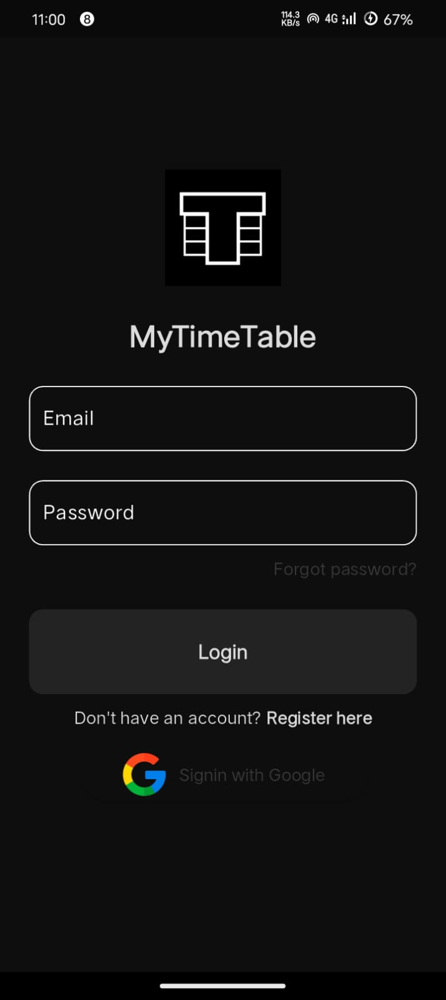
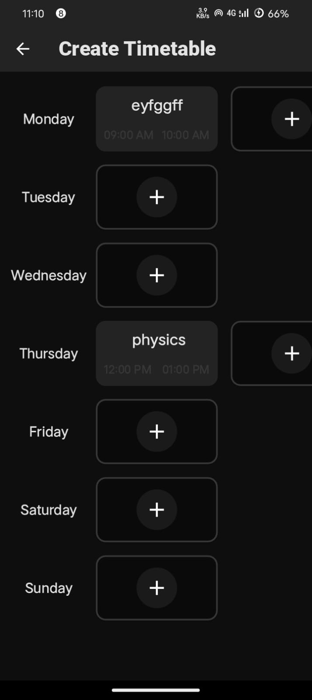
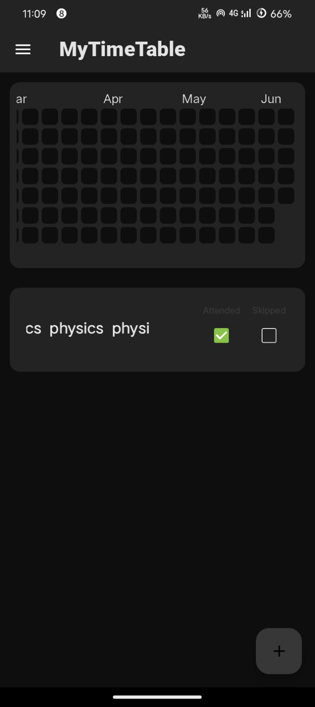

# 📅 MyTimeTable App

## 📌 Overview
**MyTimeTable** is a minimalist and user-friendly Android/iOS app built using **Flutter** that allows users to:
- Add subjects to specific days of the week.
- Track attendance by marking subjects as attended or skipped.
- Visualize productivity using a **streak board** that shows weekly efficiency.

---

## ✨ Features

### ✅ Timetable Creation
- Add any number of subjects to each weekday.
- Set start and end times for each subject.
- Edit or delete entries as needed.

### ✅ Attendance Tracker
- Mark subjects as **Attended** ✅ or **Skipped** ❌.
- Automatically updates statistics for tracking.

### ✅ Streak Board
- Shows which days were most productive based on attendance.
- Weekly grid view (calendar-style) representing each day as a dot.
- Helps build consistent study habits.

---

## 📲 Screenshots

<p float="left">
  
  
  
</p>

---

## ⚙️ Tech Stack

| Technology         | Usage                          |
|--------------------|--------------------------------|
| Flutter            | Frontend UI framework          |
| Firebase (optional)| Backend cloud sync (optional)  |
| SharedPrefs / Hive | Local data storage             |
| Dart               | Main programming language      |

---

## 🚀 How It Works

1. **Add Subjects:**
    - Tap on the `+` icon next to any weekday.
    - Enter subject name and time range.
    - Subjects appear in that day's slot.

2. **Mark Attendance:**
    - Tap the checkbox for `Attended` or `Skipped`.

3. **Track Efficiency:**
    - View the streak board to see daily patterns.
    - Black dots = subject sessions.
    - Green checks = attended.
    - Empty = skipped.

---

## 🛠️ How to Run the Project

1. **Clone this repository:**
```bash
git clone https://github.com/your-username/mytimetable-app.git
cd mytimetable-app
